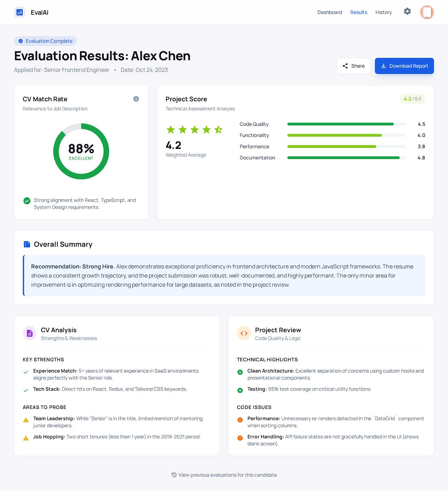
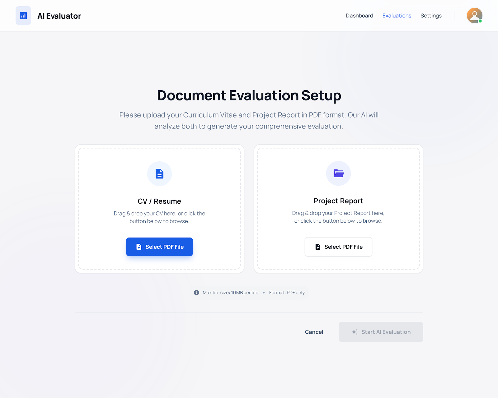
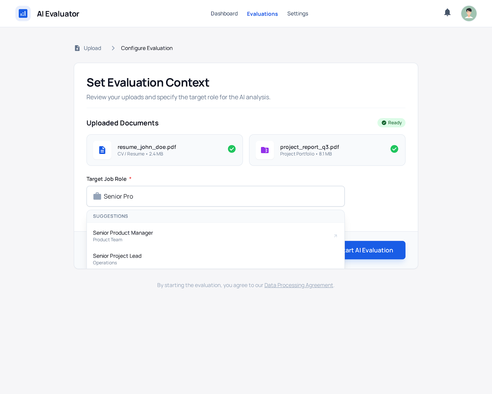
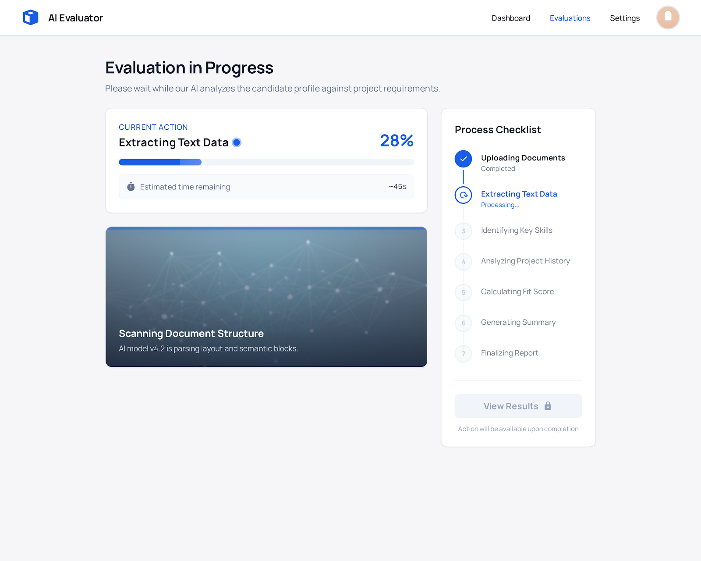
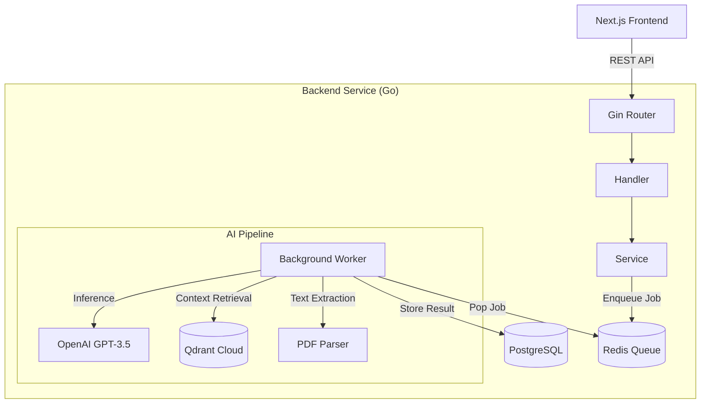

# Parsea - AI-Powered Recruitment Agent

<div align="center">



[](https://go.dev/)
[](https://nextjs.org/)
[](https://www.postgresql.org/)
[](https://redis.io/)
[](https://openai.com/)
[](https://www.docker.com/)

**An intelligent recruitment automation platform that evaluates candidate CVs against project requirements using RAG (Retrieval-Augmented Generation) and LLMs.**

[Features](#-features) • [Architecture](#-architecture) • [Gallery](#-gallery) • [Getting Started](#-getting-started)

</div>

---

## 🎯 Project Overview

**Parsea** solves the bottleneck of manual technical screening. Instead of spending hours reading resumes and comparing them against inconsistent criteria, Parsea provides instant, data-driven evaluations.

The system ingests candidate **CVs (PDF)** and **Project Reports (PDF)**, analyzes them using a robust pipeline of AI agents, and produces a structured scorecard comparing the candidate's actual skills against the specific job context.

### Why Parsea?

- **🔍 Context-Aware Analysis**: Uses Vector DB (Qdrant) to understand job nuances, not just keyword matching.
- **⚡ Asynchronous Scale**: Handles heavy PDF processing and LLM inference background jobs via Redis queues.
- **📊 Structured Scoring**: Converts subjective text into objective metrics (Match Rate, Technical Score).
- **🎨 Premium UX**: sleek, modern dashboard for recruiters to view insights.

---

## 📸 Gallery

<div align="center">
  <table>
    <tr>
      <td align="center">
        <b>1. Upload Documents</b><br/>
        
      </td>
      <td align="center">
        <b>2. Configure Evaluation</b><br/>
        
      </td>
    </tr>
    <tr>
      <td align="center">
        <b>3. Real-time Analysis</b><br/>
        
      </td>
      <td align="center">
        <b>4. Detailed Results</b><br/>
        
      </td>
    </tr>
  </table>
</div>

---

## 🏗 Architecture

The system follows a **Clean Architecture** pattern to ensure scalability and maintainability.



### Technical Highlights

*   **Backend**: Built with **Go 1.24** and **Gin**, ensuring high performance and low latency.
*   **Database**: **PostgreSQL** (via Supabase) for transactional data, **Redis** for job queues.
*   **AI/LLM**: Integrates **OpenAI** for reasoning and **Qdrant** for semantic search (RAG).
*   **Frontend**: Built with **Next.js 15**, **Tailwind CSS**, and **Framer Motion** for a responsive, interactive UI.

---

## ✨ Features

### 🤖 Intelligent "Agentic" Workflow
The backend doesn't just "call an API". It orchestrates a multi-step agentic workflow:
1.  **Ingestion**: Extracts text from unstructured PDFs.
2.  **Context Loading (RAG)**: Fetches relevant job descriptions and scoring rubrics from the vector store.
3.  **Analysis**: Evaluates the CV against the job description.
4.  **Technical Review**: Deep-dives into the project report for code quality and architecture.
5.  **Synthesis**: Combines all data into a final weighted score and summary.

### ⚡ Performance-First
*   **Concurrent Processing**: Multiple workers process evaluations in parallel.
*   **Optimized Queries**: GORM with prepared statements and connection pooling.
*   **Real-time Updates**: Frontend polls status for immediate feedback.

---

## 🚀 Getting Started

### Prerequisites

- Go 1.24+
- Node.js 18+
- Docker (optional, for Redis/Postgres)
- OpenAI API Key

### Installation

1.  **Clone the repository**
    ```bash
    git clone https://github.com/adyutaa/parsea.git
    cd parsea
    ```

2.  **Start Backend**
    ```bash
    cd backend
    cp .env.example .env  # Configure your keys
    go run cmd/server/main.go
    ```

3.  **Start Frontend**
    ```bash
    cd frontend
    npm install
    npm run dev
    ```

4.  **Access App**
    Open `http://localhost:3000` to start evaluating.

---

## 📄 License

This project is open-sourced under the MIT License.

---

<div align="center">
  <sub>Built with ❤️ by Adyuta Indra Adyatma</sub>
</div>
